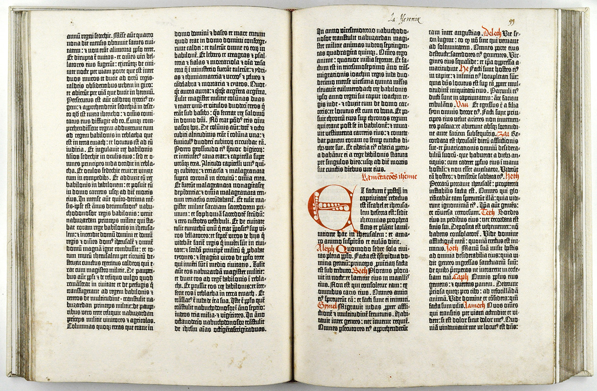
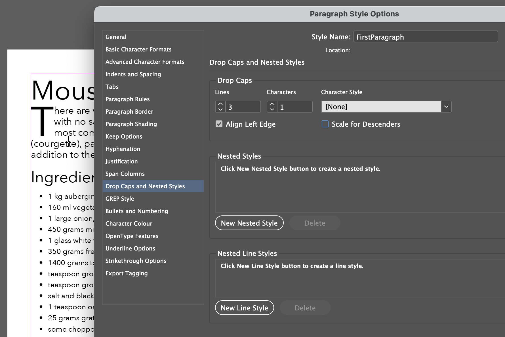
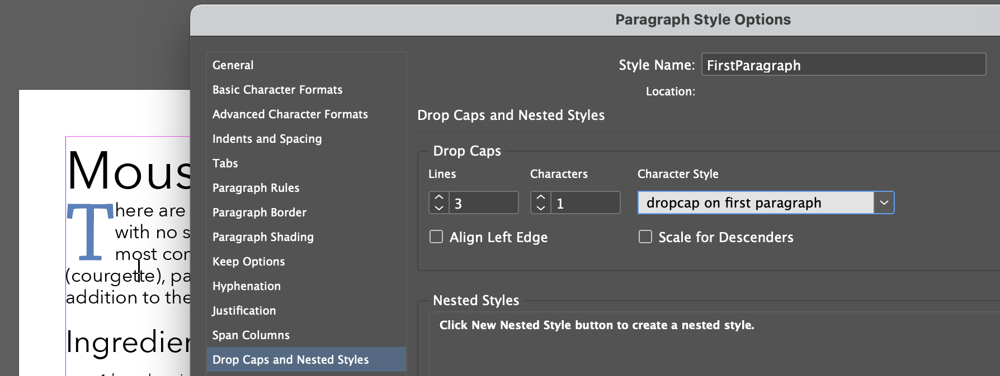
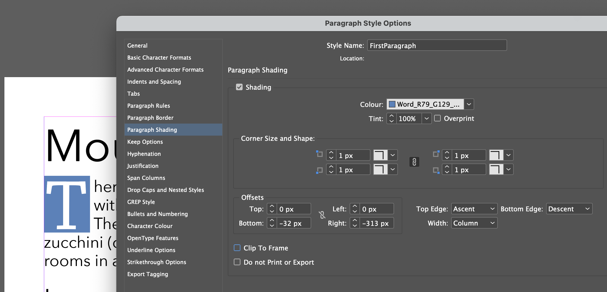

A drop cap is so called because drops down below the line in which it would normally be restricted. The amount of drop can vary but is usually defined by the number of lines. The illustration here shows a **drop** of 3 lines.

The way that the words to the right of this single character wrap or are offset is an important consideration and how this adjustment is made will depend on the platform (web or print). It also is worth considering which word will start the paragraph too, because starting with the letter **I** may look odd and confuse the reader.

## How do we achieve drop caps for print

As you may expect, I am going to talk about *InDesign* here.

To add drop caps to a paragraph we use the Drop Caps and Nested Styles feature. Here we see this in use:

### Further adjustments

As you see from above the character is in the same style as the paragraph; in this case Avenir Next. It may be desirable sometimes to use a different typeface for this single character, and we can do this by creating a character style for this purpose.

### Add a block behind

Unfortunately, InDesign does not provide a direct way to provide character shading so you need to achieve this but setting the paragraph to have shading but create offsets right and bottom to coincide with that first character.

