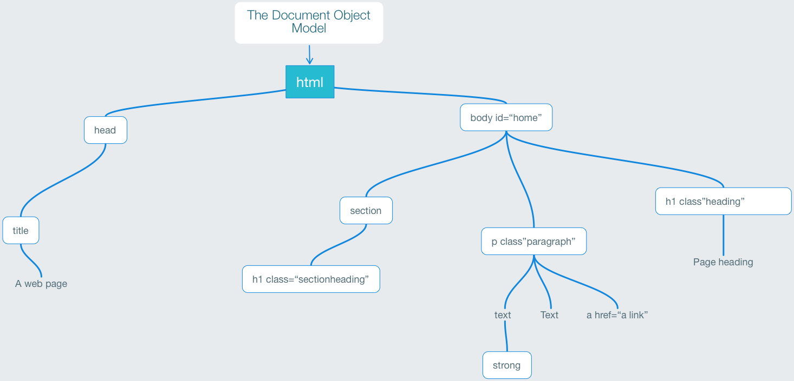

What units of measure can we use in our CSS to provide such things as font size, margins, padding and widths. There are many, including px, em, rem, vh, vw and even %. What does it all mean and how should we use these units?

## The structure of an \`HTML\` page; the hierarchy of the elements.

We should just remind ourselves about this, because some of these important units are relative – relative to the settings on their parent element.

We have `<html>` as the root element with `<body>`as the main content. Within this we will have a number of block level elements such as headings, paragraphs, sections, navs and articles.

### OK, now what about the units. Let's talk font size.

By default the root element (HTML) will already have the font size set to 16pixels; meaning that a paragraph of text will display a 16pixel height even before you begin to add CSS styles. All elements such as headings and lists will be based on this number. To make use of this value without using pixels we can use the **rem** unit. This is the root em. By default as I say this will be 16px.