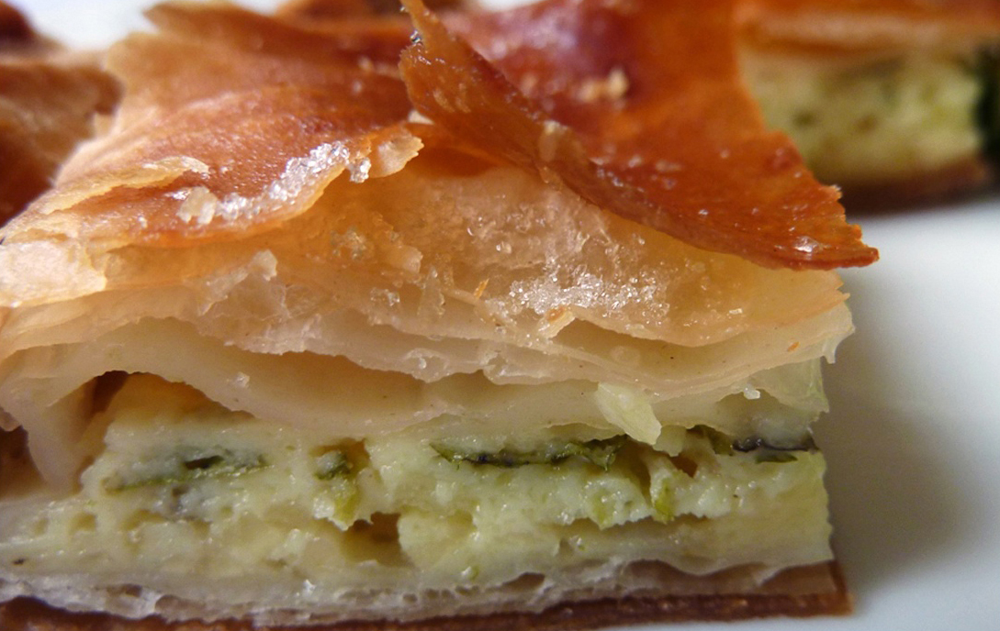

This recipe uses bechamel as well as Feta cheese. It's a common way of making the pie here in Greece and is extremely filling and nutritious, as well as being really tasty!

## Ingredients

* 1kg feta cheese crumbled
* 4 eggs
* 2 tbsp dried mint
* Freshly ground pepper to taste
* 60ml olive oil
* ½ litre fresh milk
* 125g butter
* ½ cup all-purpose flour
* 500g all-purpose flour
* 200g butter
* 260ml soda water
* 1 tsp salt

## Method

Put the flour and salt in a mixing bowl and add the soda water to make a pliable dough.

Knead the dough well for approx. 10 minutes.
Divide into 4 balls, wrap them in cling film and set aside to rest for 1 hr.

In a heavy-bottomed pan gently heat the butter until it melts.

Add the flour and stir continuously.
Add half of the milk and continue to stir with a whisk.
When the mixture starts to thicken, add the rest of the milk whilst stirring continuously.
Whisk the 4 eggs into the béchamel, mix and set aside to cool.
When it has cooled, add the feta, mint and pepper. Turn over lightly a couple of times and set aside.
Take one of the balls of dough and on a floured surface roll it out into a circle approx. 40cm diameter.
Half melt the 200g butter and brush ? of it generously over the pastry.
Fold the pastry into a square, tapping it with your hands to make sure there are no air bubbles.

**Set aside.**

Roll out another ball of dough into a circle approx. 40cm diameter.
Brush it with another ? of the half-melted butter.
Place the first square of pastry in the centre of the circle and fold into a square as in the photos below.

Wrap in cling film and leave in the fridge for 1 hr.
Repeat this process with the other 2 balls of dough.

After the 1 hr has passed, roll out one of the squares on a floured surface, large enough to cover the bottom of an oven dish (approx. 30-35cm diameter and 5cm deep) as well as the sides and to go over the edge.

Brush the oven dish with some of the oil and place the pastry on the bottom, flattening it with your hands, up the side and over the edge.

Put the filling on top of it.
Fold over the pastry on top of the edge of the filling. 

Brush the pastry with some more oil.
Roll out the other square of pastry and place it on top.
Shape the pastry around the edge.

Brush over the top with the remaining oil.

**Score the surface into portions.**

Place in a pre heated oven at 180 degrees Celsius for approx. 1 hour, until it has turned golden brown.

* Serves: 4
* Preparation time: 2 hours