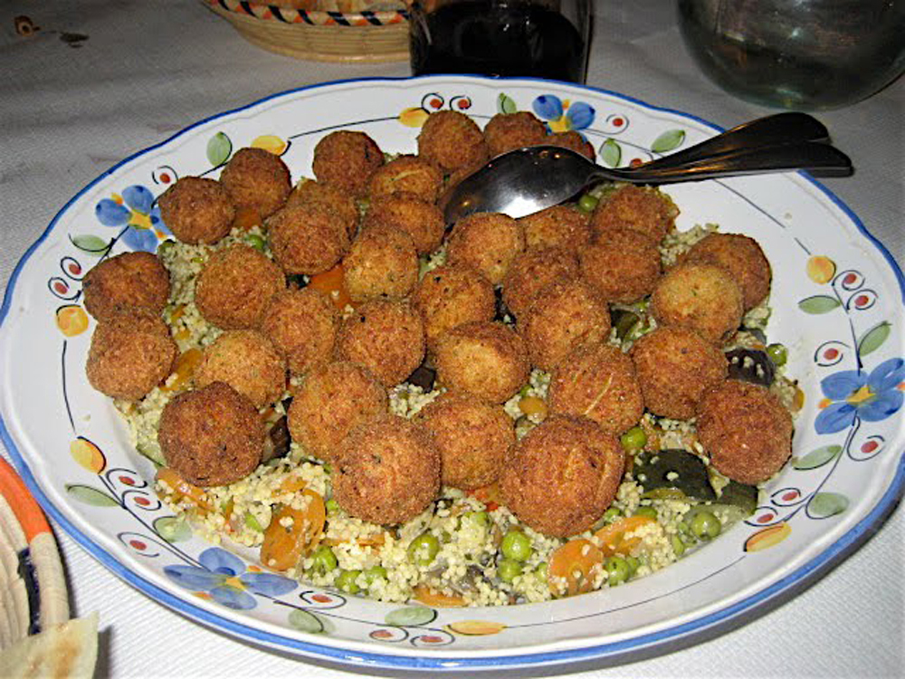

A delicious summer treat. Cook indoors or out on the barbeque. Serve up with Retsina or some cold Greek beer.
Ingredients

* 1 kg potatoes, boiled and pureed
* 4 - 5 eggs
* Bunch of parsley, finely chopped
* 1,5 cup grated dried mitzithra cheese
* Salt
* Pepper
* olive oil for frying

## Method

Mix in a bowl the mashed potatoes with the eggs. See how tight the mixture is. If it becomes to watery do not add all the eggs. Then add the rest of the ingredients. Use plenty of parsley. Work the mixture with your hands and shape it into small round balls. Coat them with flour and fry on all sides until golden brown. Do not burn the oil because this way the potato balls might burn on the outside and remain uncooked on the inside. When ready remove from frying pan lace them in a platter on top of and absorbing paper and serve.	

* Serves: 4
* Preparation time: 40 minutes