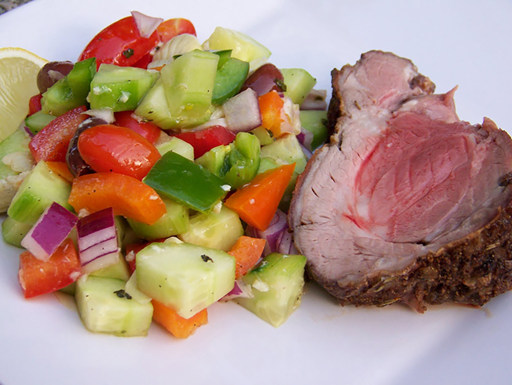

This recipe is simple and will definitely be a crowd-pleaser.

Ingredients

* 1 (5-pound) boneless leg of lamb, butterflied and trimmed
* 10 garlic cloves, smashed and halved
* ¼ cup fresh mint
* 3 tablespoons olive oil
* ½ cup dry red wine
* 3 tablespoons chopped fresh oregano (or 1 tablespoon dried)
* 1 teaspoon sea salt
* 1 tablespoon freshly ground pepper 
* Safflower oil or canola oil
* Mint Gremolata
* Garnish: fresh mint leaves

## Method

Marinate lamb 1 day ahead, and cook a few hours before your guests arrive. Slice and top with Mint Gremolata for an easy make-ahead entrée. Boneless leg of lamb can be butterflied by your local butcher; call ahead so you won't have to wait. Watch for flare-ups when grilling over direct heat.

Make about 10 small incisions on fatty side of lamb, and insert a garlic clove half and several mint leaves into each slit. Combine remaining garlic, olive oil, and next 4 ingredients. Rub marinade on both sides of lamb. Cover and chill 8 hours or overnight.

Remove from marinade, and drain slightly. Let stand 30 minutes.

Brush grill lightly with safflower oil. Grill lamb over medium-high heat for 15 minutes per side, basting frequently with marinade. Move lamb over indirect heat, and grill 10 to 15 minutes more or until meat thermometer inserted into the thickest portion of the meat registers 130° to 135° for medium-rare, turning once.

Remove from grill, and let stand on a carving board, lightly covered, at least 20 minutes. Carve into ¼-inch slices, and serve with Mint Gremolata. Garnish, if desired.

* Serves: 6
* Preparation time: 1 hour