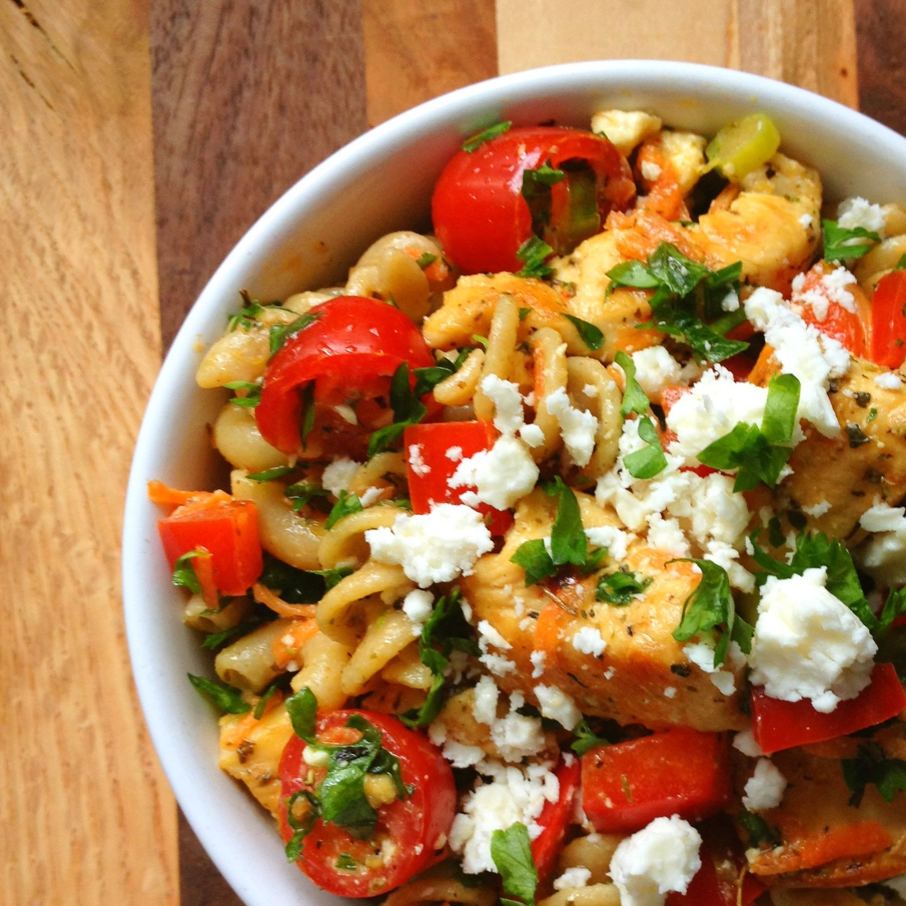

This Pasta salad makes a deliciously filling meal and there is enough ingredients to feed 4 people.

## Ingredients

* ¼ cup (50 mL) olive oil
* 1 ½ tbsp (25 mL) lemon juice
* half cup of fresh oregano and parsley, chopped
* 1 garlic clove, chopped
* 2 tablespoons of mayonnaise
* 1-½ cups (375 mL) penne pasta,, or bow tie cooked, drained
* 1 cup (250 mL) crumbled Feta cheese, (optional)
* 1 cup (250 mL) diced tomato
* 1 cup (250 mL) seedless cucumber, diced
* ½ cup (125 mL) each sliced pitted black olives
* ½ cup (125 mL) green pepper,or cooked green beans, sliced.
* 2 chopped spring onions, Salt and pepper
* 2 cooled cooked chicken breasts, thinly sliced or cubed.

## Method

In a blender place oil, lemon juice, half the oregano and parsley, mayonnaise and garlic.

Cover and blend at high speed until mixture is creamy.

In large salad bowl, combine pasta, Feta cheese, tomato, cucumber, olives, green pepper, the rest of the parsley and oregano, onions and sliced chicken. 

Pour in creamy dressing and toss well. Add salt and pepper to taste. Chill before serving to enhance the flavours.