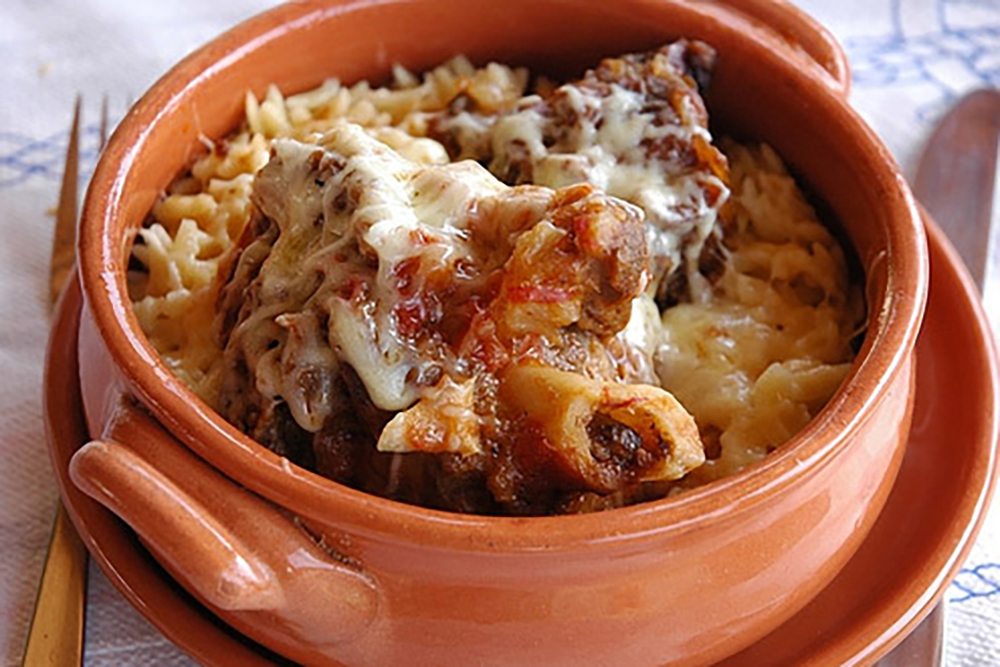

Orzo Pasta looks a little like long grain rice, and is most versatile. I've seen this Greek pasta accompany stews and roast lamb, and I've also seen it with curry; I like it best served as a pasta salad. This recipe ingredient list is for 8 people, hope you enjoy.

## Ingredients

* 1 large cup of uncooked Orzo pasta
* 2 tomatoes, chopped as desired usually about half inch pieces
* ½ cucumber peeled and chopped
* 1 small red onion chopped
* 1 pepper, red, green or orange also chopped
* Half a cup of mixed oregano, and parsley, chopped.
* One block of feta cheese, whole or crumbled

## Method

Make the dressing with the following ingredients; half a cup of red wine vinegar, half a teaspoon of sugar,
salt and pepper and half cup of extra virgin olive oil

Place orzo pasta into a pan of boiling water and cook as directed by instructions on packet.
Leave to Cool, then place into serving dish.

Mix together the chopped tomatoes, cucumber, onion, and pepper and add to cooled pasta.
Place the feta on top of pasta salad mixture and dress with chopped herbs.
Drizzle over the dressing. this can be served immediately or put in the refrigerator until needed. This Greek pasta salad is traditionally served with Greek olives. 

* Serves 2
* Preparation time: 30minutes