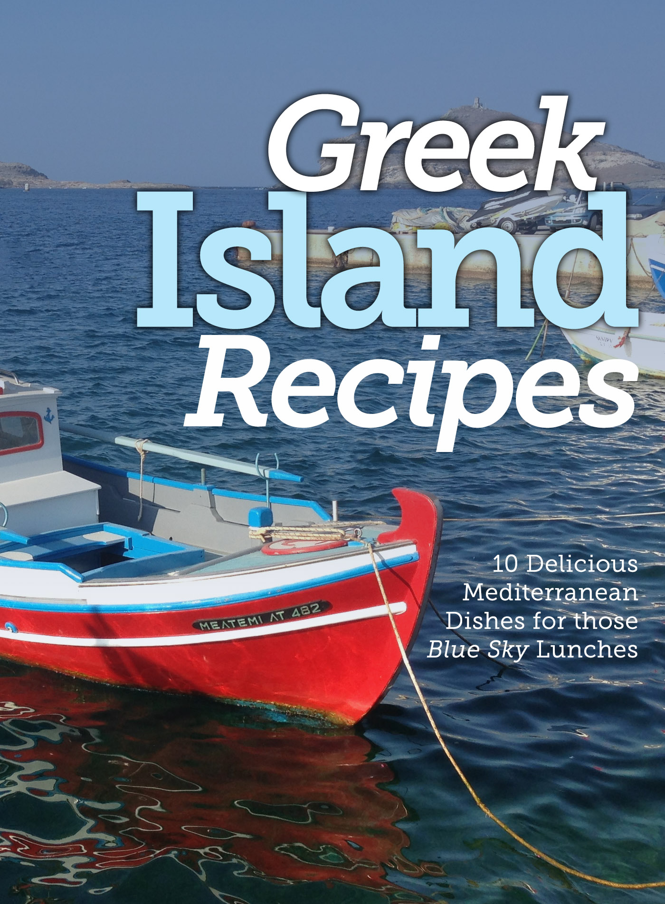

Stretching from the shores of Turkey to the Ionian Sea east of Italy, the Greek islands have been the crossroads of the Mediterranean since the time of Homer and boast some of the most intrig11ing food in the world.

Simple but never plain, the cooking of the islands relies on flavorful ingredients rather than complicated techniques, making extensive use of seasonal vegetables, fresh herbs, grains and beans, olives and olive oil, cheeses and fish.

Inflected with subtle Italian and Eastern accents, the cuisine is at once straightforward and sophisticated.